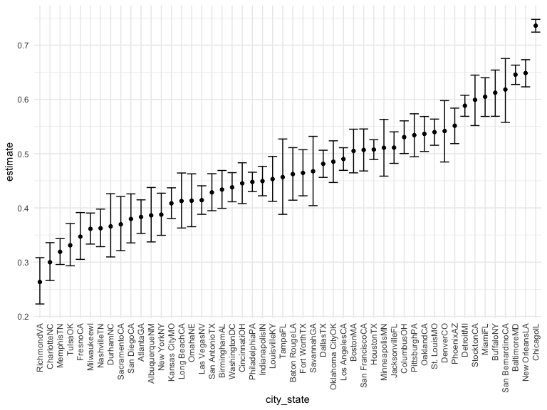

p8105\_hw5\_sg3891
================
Sandya Ganesh
2021-11-20

## Problem 1

#### Clean data and create function

``` r
homicide_df =
  read_csv("./data/homicide-data.csv", na = c("", "Unknown")) %>% 
  mutate(
    city_state = str_c(city, state),
    resolution = case_when(
      disposition == "Closed without arrest" ~ "unsolved",
      disposition == "Open/No arrest" ~ "unsolved",
      disposition == "Closed by arrest" ~ "solved"
      )) %>% 
  relocate(city_state) %>% 
  filter(city_state != "TulsaAL")
```

    ## Rows: 52179 Columns: 12

    ## ── Column specification ────────────────────────────────────────────────────────
    ## Delimiter: ","
    ## chr (8): uid, victim_last, victim_first, victim_race, victim_sex, city, stat...
    ## dbl (4): reported_date, victim_age, lat, lon

    ## 
    ## ℹ Use `spec()` to retrieve the full column specification for this data.
    ## ℹ Specify the column types or set `show_col_types = FALSE` to quiet this message.

``` r
baltimore_df = 
  homicide_df %>% 
  filter(city_state == "BaltimoreMD")

baltimore_summary = 
  baltimore_df %>% 
  summarize(
    unsolved = sum(resolution == "unsolved"),
    n = n()
  )

baltimore_test =
prop.test(
  x = baltimore_summary %>% pull(unsolved),
  n = baltimore_summary %>% pull(n))

baltimore_test %>% 
  broom::tidy()
```

    ## # A tibble: 1 × 8
    ##   estimate statistic  p.value parameter conf.low conf.high method    alternative
    ##      <dbl>     <dbl>    <dbl>     <int>    <dbl>     <dbl> <chr>     <chr>      
    ## 1    0.646      239. 6.46e-54         1    0.628     0.663 1-sample… two.sided

``` r
prop_test_function = function(city_df) {
  
  city_summary =
    city_df %>%
    summarize(
      unsolved = sum(resolution == "unsolved"),
      n = n()
    )

  city_test =
    prop.test(
      x = city_summary %>% pull(unsolved),
      n = city_summary %>% pull(n))
  
  return(city_test)
}

prop_test_function(baltimore_df)
```

    ## 
    ##  1-sample proportions test with continuity correction
    ## 
    ## data:  city_summary %>% pull(unsolved) out of city_summary %>% pull(n), null probability 0.5
    ## X-squared = 239.01, df = 1, p-value < 2.2e-16
    ## alternative hypothesis: true p is not equal to 0.5
    ## 95 percent confidence interval:
    ##  0.6275625 0.6631599
    ## sample estimates:
    ##         p 
    ## 0.6455607

``` r
homicide_df %>% 
  filter(city_state == "AlbuquerqueNM") %>% 
  prop_test_function()
```

    ## 
    ##  1-sample proportions test with continuity correction
    ## 
    ## data:  city_summary %>% pull(unsolved) out of city_summary %>% pull(n), null probability 0.5
    ## X-squared = 19.114, df = 1, p-value = 1.232e-05
    ## alternative hypothesis: true p is not equal to 0.5
    ## 95 percent confidence interval:
    ##  0.3372604 0.4375766
    ## sample estimates:
    ##         p 
    ## 0.3862434

``` r
results_df = 
  homicide_df %>% 
  nest(data = uid:resolution) %>% 
  mutate(
    test_results = map(data, prop_test_function),
    tidy_results = map(test_results, broom::tidy)
  ) %>% 
  select(city_state, tidy_results) %>% 
  unnest(tidy_results) %>% 
  select(city_state, estimate, starts_with("conf"))
```

#### Plot data to show estimates and confidence intervals

``` r
results_df %>% 
  mutate(city_state = fct_reorder(city_state, estimate)) %>% 
  ggplot(aes(x = city_state, y = estimate)) +
  geom_point() +
  geom_errorbar(aes(ymin = conf.low, ymax = conf.high)) +
  theme(axis.text.x = element_text(angle = 90, vjust = 0.5, hjust=1))
```



## Problem 2

``` r
long_data = 
  tibble(
  files = list.files("./data/zip_data/")) %>%
  mutate(
    subject_data = map(files, ~read_csv(file.path("./data/zip_data/",.)))
  ) %>%
  unnest(subject_data) %>%
  mutate(
    arm = substr(files,1L,3L),
    subject_id = substr(files,1L,6L)
  ) %>% 
  pivot_longer(
    cols = starts_with("week"),
    names_to = "week",
    names_prefix = "week_",
    values_to = "observation"
  ) %>% 
  select(arm, subject_id, week, observation)
```

    ## Rows: 1 Columns: 8

    ## ── Column specification ────────────────────────────────────────────────────────
    ## Delimiter: ","
    ## dbl (8): week_1, week_2, week_3, week_4, week_5, week_6, week_7, week_8

    ## 
    ## ℹ Use `spec()` to retrieve the full column specification for this data.
    ## ℹ Specify the column types or set `show_col_types = FALSE` to quiet this message.

    ## Rows: 1 Columns: 8

    ## ── Column specification ────────────────────────────────────────────────────────
    ## Delimiter: ","
    ## dbl (8): week_1, week_2, week_3, week_4, week_5, week_6, week_7, week_8

    ## 
    ## ℹ Use `spec()` to retrieve the full column specification for this data.
    ## ℹ Specify the column types or set `show_col_types = FALSE` to quiet this message.

    ## Rows: 1 Columns: 8

    ## ── Column specification ────────────────────────────────────────────────────────
    ## Delimiter: ","
    ## dbl (8): week_1, week_2, week_3, week_4, week_5, week_6, week_7, week_8

    ## 
    ## ℹ Use `spec()` to retrieve the full column specification for this data.
    ## ℹ Specify the column types or set `show_col_types = FALSE` to quiet this message.

    ## Rows: 1 Columns: 8

    ## ── Column specification ────────────────────────────────────────────────────────
    ## Delimiter: ","
    ## dbl (8): week_1, week_2, week_3, week_4, week_5, week_6, week_7, week_8

    ## 
    ## ℹ Use `spec()` to retrieve the full column specification for this data.
    ## ℹ Specify the column types or set `show_col_types = FALSE` to quiet this message.

    ## Rows: 1 Columns: 8

    ## ── Column specification ────────────────────────────────────────────────────────
    ## Delimiter: ","
    ## dbl (8): week_1, week_2, week_3, week_4, week_5, week_6, week_7, week_8

    ## 
    ## ℹ Use `spec()` to retrieve the full column specification for this data.
    ## ℹ Specify the column types or set `show_col_types = FALSE` to quiet this message.

    ## Rows: 1 Columns: 8

    ## ── Column specification ────────────────────────────────────────────────────────
    ## Delimiter: ","
    ## dbl (8): week_1, week_2, week_3, week_4, week_5, week_6, week_7, week_8

    ## 
    ## ℹ Use `spec()` to retrieve the full column specification for this data.
    ## ℹ Specify the column types or set `show_col_types = FALSE` to quiet this message.

    ## Rows: 1 Columns: 8

    ## ── Column specification ────────────────────────────────────────────────────────
    ## Delimiter: ","
    ## dbl (8): week_1, week_2, week_3, week_4, week_5, week_6, week_7, week_8

    ## 
    ## ℹ Use `spec()` to retrieve the full column specification for this data.
    ## ℹ Specify the column types or set `show_col_types = FALSE` to quiet this message.

    ## Rows: 1 Columns: 8

    ## ── Column specification ────────────────────────────────────────────────────────
    ## Delimiter: ","
    ## dbl (8): week_1, week_2, week_3, week_4, week_5, week_6, week_7, week_8

    ## 
    ## ℹ Use `spec()` to retrieve the full column specification for this data.
    ## ℹ Specify the column types or set `show_col_types = FALSE` to quiet this message.

    ## Rows: 1 Columns: 8

    ## ── Column specification ────────────────────────────────────────────────────────
    ## Delimiter: ","
    ## dbl (8): week_1, week_2, week_3, week_4, week_5, week_6, week_7, week_8

    ## 
    ## ℹ Use `spec()` to retrieve the full column specification for this data.
    ## ℹ Specify the column types or set `show_col_types = FALSE` to quiet this message.

    ## Rows: 1 Columns: 8

    ## ── Column specification ────────────────────────────────────────────────────────
    ## Delimiter: ","
    ## dbl (8): week_1, week_2, week_3, week_4, week_5, week_6, week_7, week_8

    ## 
    ## ℹ Use `spec()` to retrieve the full column specification for this data.
    ## ℹ Specify the column types or set `show_col_types = FALSE` to quiet this message.

    ## Rows: 1 Columns: 8

    ## ── Column specification ────────────────────────────────────────────────────────
    ## Delimiter: ","
    ## dbl (8): week_1, week_2, week_3, week_4, week_5, week_6, week_7, week_8

    ## 
    ## ℹ Use `spec()` to retrieve the full column specification for this data.
    ## ℹ Specify the column types or set `show_col_types = FALSE` to quiet this message.

    ## Rows: 1 Columns: 8

    ## ── Column specification ────────────────────────────────────────────────────────
    ## Delimiter: ","
    ## dbl (8): week_1, week_2, week_3, week_4, week_5, week_6, week_7, week_8

    ## 
    ## ℹ Use `spec()` to retrieve the full column specification for this data.
    ## ℹ Specify the column types or set `show_col_types = FALSE` to quiet this message.

    ## Rows: 1 Columns: 8

    ## ── Column specification ────────────────────────────────────────────────────────
    ## Delimiter: ","
    ## dbl (8): week_1, week_2, week_3, week_4, week_5, week_6, week_7, week_8

    ## 
    ## ℹ Use `spec()` to retrieve the full column specification for this data.
    ## ℹ Specify the column types or set `show_col_types = FALSE` to quiet this message.

    ## Rows: 1 Columns: 8

    ## ── Column specification ────────────────────────────────────────────────────────
    ## Delimiter: ","
    ## dbl (8): week_1, week_2, week_3, week_4, week_5, week_6, week_7, week_8

    ## 
    ## ℹ Use `spec()` to retrieve the full column specification for this data.
    ## ℹ Specify the column types or set `show_col_types = FALSE` to quiet this message.

    ## Rows: 1 Columns: 8

    ## ── Column specification ────────────────────────────────────────────────────────
    ## Delimiter: ","
    ## dbl (8): week_1, week_2, week_3, week_4, week_5, week_6, week_7, week_8

    ## 
    ## ℹ Use `spec()` to retrieve the full column specification for this data.
    ## ℹ Specify the column types or set `show_col_types = FALSE` to quiet this message.

    ## Rows: 1 Columns: 8

    ## ── Column specification ────────────────────────────────────────────────────────
    ## Delimiter: ","
    ## dbl (8): week_1, week_2, week_3, week_4, week_5, week_6, week_7, week_8

    ## 
    ## ℹ Use `spec()` to retrieve the full column specification for this data.
    ## ℹ Specify the column types or set `show_col_types = FALSE` to quiet this message.

    ## Rows: 1 Columns: 8

    ## ── Column specification ────────────────────────────────────────────────────────
    ## Delimiter: ","
    ## dbl (8): week_1, week_2, week_3, week_4, week_5, week_6, week_7, week_8

    ## 
    ## ℹ Use `spec()` to retrieve the full column specification for this data.
    ## ℹ Specify the column types or set `show_col_types = FALSE` to quiet this message.

    ## Rows: 1 Columns: 8

    ## ── Column specification ────────────────────────────────────────────────────────
    ## Delimiter: ","
    ## dbl (8): week_1, week_2, week_3, week_4, week_5, week_6, week_7, week_8

    ## 
    ## ℹ Use `spec()` to retrieve the full column specification for this data.
    ## ℹ Specify the column types or set `show_col_types = FALSE` to quiet this message.

    ## Rows: 1 Columns: 8

    ## ── Column specification ────────────────────────────────────────────────────────
    ## Delimiter: ","
    ## dbl (8): week_1, week_2, week_3, week_4, week_5, week_6, week_7, week_8

    ## 
    ## ℹ Use `spec()` to retrieve the full column specification for this data.
    ## ℹ Specify the column types or set `show_col_types = FALSE` to quiet this message.

    ## Rows: 1 Columns: 8

    ## ── Column specification ────────────────────────────────────────────────────────
    ## Delimiter: ","
    ## dbl (8): week_1, week_2, week_3, week_4, week_5, week_6, week_7, week_8

    ## 
    ## ℹ Use `spec()` to retrieve the full column specification for this data.
    ## ℹ Specify the column types or set `show_col_types = FALSE` to quiet this message.

## Problem 3

#### Introduce missing values into iris dataset

``` r
set.seed(10)

iris_with_missing = iris %>% 
  map_df(~replace(.x, sample(1:150, 20), NA)) %>%
  mutate(Species = as.character(Species))
```

#### Write and apply function to replace missing values

``` r
fill_missing = function(vector) {

  if (is.numeric(vector)) {
    vector = replace_na(vector, round(mean(vector, na.rm = TRUE), 2))
  }
  
  if (is.character(vector)) {
    vector = replace_na(vector, "virginica")
  }
  
  return(vector)

}

map(iris_with_missing, fill_missing)
```

    ## $Sepal.Length
    ##   [1] 5.10 4.90 4.70 4.60 5.00 5.40 5.82 5.00 4.40 4.90 5.40 4.80 5.82 4.30 5.82
    ##  [16] 5.70 5.40 5.10 5.70 5.10 5.40 5.10 4.60 5.82 4.80 5.00 5.00 5.20 5.82 4.70
    ##  [31] 4.80 5.40 5.20 5.50 4.90 5.00 5.50 4.90 4.40 5.10 5.00 4.50 4.40 5.00 5.10
    ##  [46] 4.80 5.10 4.60 5.30 5.00 7.00 6.40 6.90 5.50 6.50 5.70 6.30 4.90 6.60 5.20
    ##  [61] 5.00 5.90 6.00 6.10 5.60 6.70 5.60 5.80 6.20 5.60 5.90 5.82 6.30 5.82 6.40
    ##  [76] 6.60 6.80 6.70 6.00 5.70 5.50 5.82 5.80 6.00 5.40 5.82 6.70 5.82 5.60 5.50
    ##  [91] 5.50 5.82 5.80 5.00 5.82 5.70 5.70 6.20 5.10 5.70 6.30 5.80 7.10 6.30 6.50
    ## [106] 7.60 4.90 7.30 6.70 5.82 6.50 5.82 6.80 5.70 5.80 6.40 6.50 7.70 7.70 6.00
    ## [121] 5.82 5.60 7.70 6.30 6.70 7.20 6.20 6.10 6.40 7.20 7.40 7.90 6.40 5.82 6.10
    ## [136] 5.82 5.82 6.40 6.00 6.90 6.70 6.90 5.82 6.80 6.70 6.70 6.30 6.50 5.82 5.90
    ## 
    ## $Sepal.Width
    ##   [1] 3.50 3.00 3.20 3.10 3.60 3.90 3.40 3.40 2.90 3.10 3.08 3.40 3.08 3.00 4.00
    ##  [16] 4.40 3.90 3.50 3.80 3.80 3.40 3.70 3.60 3.30 3.40 3.00 3.40 3.50 3.40 3.20
    ##  [31] 3.10 3.08 3.08 4.20 3.10 3.20 3.50 3.60 3.00 3.40 3.50 3.08 3.20 3.50 3.80
    ##  [46] 3.00 3.80 3.20 3.70 3.08 3.08 3.20 3.10 2.30 2.80 2.80 3.30 2.40 2.90 2.70
    ##  [61] 2.00 3.00 2.20 2.90 2.90 3.10 3.00 3.08 2.20 2.50 3.20 2.80 2.50 2.80 2.90
    ##  [76] 3.00 2.80 3.08 3.08 2.60 2.40 2.40 2.70 2.70 3.00 3.40 3.10 3.08 3.00 2.50
    ##  [91] 3.08 3.08 3.08 2.30 2.70 3.00 2.90 2.90 2.50 2.80 3.08 2.70 3.00 2.90 3.08
    ## [106] 3.00 2.50 2.90 3.08 3.60 3.20 2.70 3.00 3.08 2.80 3.20 3.00 3.80 2.60 2.20
    ## [121] 3.20 3.08 2.80 2.70 3.30 3.20 2.80 3.00 2.80 3.00 2.80 3.80 2.80 2.80 3.08
    ## [136] 3.00 3.40 3.10 3.00 3.10 3.10 3.10 2.70 3.20 3.30 3.00 2.50 3.00 3.40 3.00
    ## 
    ## $Petal.Length
    ##   [1] 1.40 1.40 1.30 1.50 1.40 1.70 1.40 1.50 1.40 3.77 1.50 1.60 1.40 3.77 3.77
    ##  [16] 1.50 1.30 1.40 1.70 1.50 1.70 1.50 1.00 3.77 1.90 3.77 1.60 1.50 1.40 1.60
    ##  [31] 3.77 1.50 1.50 1.40 3.77 1.20 1.30 1.40 1.30 1.50 1.30 1.30 1.30 1.60 1.90
    ##  [46] 1.40 1.60 3.77 1.50 1.40 4.70 4.50 4.90 4.00 4.60 4.50 4.70 3.77 4.60 3.90
    ##  [61] 3.77 4.20 4.00 4.70 3.60 4.40 4.50 4.10 4.50 3.90 4.80 4.00 4.90 3.77 4.30
    ##  [76] 4.40 4.80 5.00 4.50 3.50 3.80 3.70 3.90 5.10 4.50 4.50 4.70 4.40 3.77 4.00
    ##  [91] 4.40 4.60 4.00 3.30 4.20 4.20 4.20 4.30 3.00 4.10 3.77 5.10 5.90 5.60 5.80
    ## [106] 6.60 4.50 6.30 3.77 3.77 5.10 5.30 5.50 5.00 5.10 5.30 3.77 6.70 6.90 5.00
    ## [121] 5.70 4.90 6.70 4.90 5.70 6.00 4.80 4.90 5.60 5.80 6.10 3.77 3.77 5.10 5.60
    ## [136] 6.10 5.60 5.50 4.80 5.40 5.60 5.10 5.10 3.77 3.77 5.20 5.00 5.20 5.40 5.10
    ## 
    ## $Petal.Width
    ##   [1] 0.20 0.20 0.20 1.19 0.20 0.40 0.30 0.20 0.20 0.10 0.20 0.20 0.10 0.10 0.20
    ##  [16] 0.40 0.40 1.19 0.30 1.19 0.20 0.40 0.20 0.50 0.20 0.20 0.40 0.20 0.20 0.20
    ##  [31] 0.20 0.40 0.10 0.20 0.20 0.20 0.20 0.10 1.19 0.20 0.30 1.19 0.20 0.60 0.40
    ##  [46] 0.30 0.20 0.20 0.20 0.20 1.40 1.50 1.50 1.30 1.50 1.30 1.60 1.00 1.30 1.40
    ##  [61] 1.00 1.50 1.19 1.40 1.30 1.40 1.50 1.00 1.50 1.10 1.80 1.30 1.50 1.20 1.30
    ##  [76] 1.40 1.40 1.19 1.19 1.00 1.10 1.00 1.20 1.60 1.50 1.60 1.19 1.30 1.19 1.19
    ##  [91] 1.20 1.19 1.19 1.19 1.30 1.20 1.30 1.30 1.19 1.30 2.50 1.90 2.10 1.80 2.20
    ## [106] 2.10 1.70 1.80 1.80 2.50 2.00 1.90 2.10 2.00 2.40 2.30 1.80 1.19 2.30 1.50
    ## [121] 1.19 2.00 2.00 1.80 2.10 1.80 1.80 1.80 2.10 1.60 1.19 2.00 2.20 1.50 1.40
    ## [136] 2.30 1.19 1.19 1.80 2.10 2.40 2.30 1.90 2.30 2.50 2.30 1.90 2.00 2.30 1.80
    ## 
    ## $Species
    ##   [1] "setosa"     "setosa"     "setosa"     "setosa"     "setosa"    
    ##   [6] "setosa"     "setosa"     "setosa"     "setosa"     "setosa"    
    ##  [11] "setosa"     "setosa"     "setosa"     "setosa"     "setosa"    
    ##  [16] "setosa"     "setosa"     "setosa"     "setosa"     "setosa"    
    ##  [21] "setosa"     "virginica"  "setosa"     "setosa"     "virginica" 
    ##  [26] "setosa"     "virginica"  "setosa"     "setosa"     "setosa"    
    ##  [31] "setosa"     "setosa"     "setosa"     "setosa"     "setosa"    
    ##  [36] "setosa"     "setosa"     "setosa"     "setosa"     "setosa"    
    ##  [41] "setosa"     "virginica"  "setosa"     "setosa"     "setosa"    
    ##  [46] "virginica"  "setosa"     "setosa"     "setosa"     "setosa"    
    ##  [51] "virginica"  "versicolor" "versicolor" "versicolor" "versicolor"
    ##  [56] "versicolor" "virginica"  "versicolor" "virginica"  "versicolor"
    ##  [61] "versicolor" "versicolor" "versicolor" "versicolor" "versicolor"
    ##  [66] "versicolor" "versicolor" "versicolor" "versicolor" "versicolor"
    ##  [71] "versicolor" "virginica"  "versicolor" "versicolor" "versicolor"
    ##  [76] "versicolor" "versicolor" "versicolor" "versicolor" "virginica" 
    ##  [81] "versicolor" "versicolor" "versicolor" "versicolor" "versicolor"
    ##  [86] "versicolor" "versicolor" "versicolor" "versicolor" "versicolor"
    ##  [91] "versicolor" "versicolor" "versicolor" "virginica"  "versicolor"
    ##  [96] "versicolor" "versicolor" "versicolor" "versicolor" "virginica" 
    ## [101] "virginica"  "virginica"  "virginica"  "virginica"  "virginica" 
    ## [106] "virginica"  "virginica"  "virginica"  "virginica"  "virginica" 
    ## [111] "virginica"  "virginica"  "virginica"  "virginica"  "virginica" 
    ## [116] "virginica"  "virginica"  "virginica"  "virginica"  "virginica" 
    ## [121] "virginica"  "virginica"  "virginica"  "virginica"  "virginica" 
    ## [126] "virginica"  "virginica"  "virginica"  "virginica"  "virginica" 
    ## [131] "virginica"  "virginica"  "virginica"  "virginica"  "virginica" 
    ## [136] "virginica"  "virginica"  "virginica"  "virginica"  "virginica" 
    ## [141] "virginica"  "virginica"  "virginica"  "virginica"  "virginica" 
    ## [146] "virginica"  "virginica"  "virginica"  "virginica"  "virginica"
