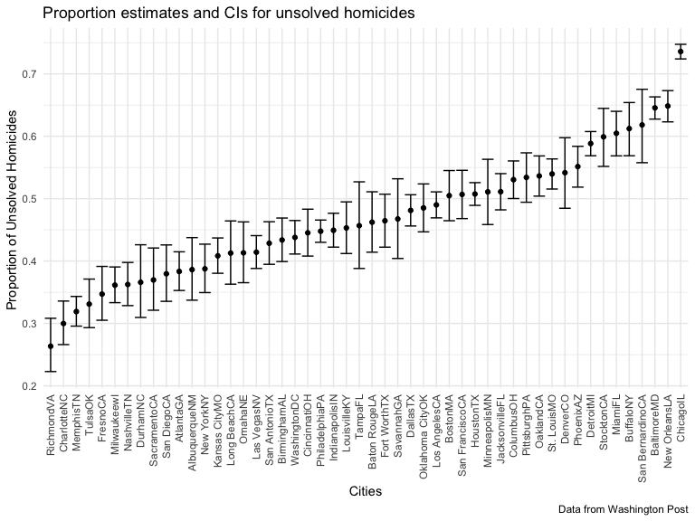
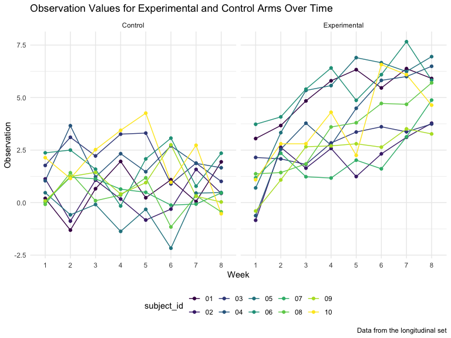

p8105\_hw5\_sg3891
================
Sandya Ganesh
2021-11-20

## Problem 1

Read in and clean the data.

``` r
raw_homicide_df =
  read_csv("./data/homicide-data.csv", na = c("", "Unknown"), show_col_types = FALSE)

homicide_df = raw_homicide_df %>% 
  mutate(
    city_state = str_c(city, state),
    resolution = case_when(
      disposition == "Closed without arrest" ~ "unsolved",
      disposition == "Open/No arrest" ~ "unsolved",
      disposition == "Closed by arrest" ~ "solved"
      )) %>% 
  relocate(city_state) %>% 
  filter(city_state != "TulsaAL")
```

The total number of observations in the homicide data set from the
Washington Post is 52179 observations with 12 variables. Some key
variables in this data set include city, state, disposition.

In the code chunk below we summarize within cities to obtain the total
number of homicides and the number of unsolved homicides, and run a prop
test for a single city (Baltimore).

``` r
baltimore_df = 
  homicide_df %>% 
  filter(city_state == "BaltimoreMD")

baltimore_summary = 
  baltimore_df %>% 
  summarize(
    unsolved = sum(resolution == "unsolved"),
    n = n()
  )

baltimore_test =
prop.test(
  x = baltimore_summary %>% pull(unsolved),
  n = baltimore_summary %>% pull(n))

baltimore_test %>% 
  broom::tidy()
```

    ## # A tibble: 1 × 8
    ##   estimate statistic  p.value parameter conf.low conf.high method    alternative
    ##      <dbl>     <dbl>    <dbl>     <int>    <dbl>     <dbl> <chr>     <chr>      
    ## 1    0.646      239. 6.46e-54         1    0.628     0.663 1-sample… two.sided

In the 2 code chunks below we create a function to run prop.test for
each of the cities in the dataset, and extract both the proportion of
unsolved homicides and the confidence interval for each.

``` r
prop_test_function = function(city_df) {
  
  city_summary =
    city_df %>%
    summarize(
      unsolved = sum(resolution == "unsolved"),
      n = n()
    )

  city_test =
    prop.test(
      x = city_summary %>% pull(unsolved),
      n = city_summary %>% pull(n))
  
  return(city_test)
}
```

``` r
results_df = 
  homicide_df %>% 
  nest(data = uid:resolution) %>% 
  mutate(
    test_results = map(data, prop_test_function),
    tidy_results = map(test_results, broom::tidy)
  ) %>% 
  select(city_state, tidy_results) %>% 
  unnest(tidy_results) %>% 
  select(city_state, estimate, starts_with("conf"))
```

Finally, we plot the data to show estimates and confidence intervals for
each city

``` r
results_df %>% 
  mutate(city_state = fct_reorder(city_state, estimate)) %>% 
  ggplot(aes(x = city_state, y = estimate)) +
  geom_point() +
  geom_errorbar(aes(ymin = conf.low, ymax = conf.high)) +
  theme(axis.text.x = element_text(angle = 90, vjust = 0.5, hjust = 1)) +
  labs(
    title = "Proportion estimates and CIs for unsolved homicides",
    x = "Cities",
    y = "Proportion of Unsolved Homicides ",
    caption = "Data from Washington Post")
```



## Problem 2

The code chunks for problem 2 utilize a longitudinal study data set with
an experimental and control arm.

#### Clean and tidy data

In the code chunk below we create a tidy dataframe containing data from
all participants, including the subject ID, arm, and observations over
time

``` r
long_data = 
  tibble(
  files = list.files("./data/zip_data/")) %>%
  mutate(
    subject_data = map(files, ~read_csv(file.path("./data/zip_data/",.), show_col_types = FALSE))
  ) %>%
  unnest(subject_data) %>%
  mutate(
    arm = ifelse(str_detect(files, "con"), "Control", "Experimental"),
    subject_id = substr(files,5L,6L)
  ) %>% 
  pivot_longer(
    cols = starts_with("week"),
    names_to = "week",
    names_prefix = "week_",
    values_to = "observation"
  ) %>% 
  select(arm, subject_id, week, observation)
```

#### Spaghetti Plot

In the code chunk below we make a spaghetti plot that displays
observations on each subject over time, and comment on differences
between groups.

``` r
long_data %>% 
  group_by(subject_id, week) %>% 
  ggplot(aes(x = week, y = observation, color = subject_id)) + 
  geom_line(aes(group = subject_id)) + 
  geom_point() +
  facet_grid(. ~arm) +
  labs(
    title = "Observation Values for Experimental and Control Arms Over Time",
    x = "Week",
    y = "Observation",
    color = "subject_id",
    caption = "Data from the longitudinal set")
```



Looking at the control group, there is no obvious trend in observations
across the 8 weeks, with values tending to remain the same on average
across the study. However in the experimental group, we can see that
there is a clear upwards trend, with the observation values increasing
as weeks increase. Therefore, comparing the two arms, we can see that
while at week 1 the observation values were fairly similar between the
two arms, at week 8 (by the end of study), the observation values for
the experimental group are much higher than the control group.

## Problem 3

#### Introduce missing values into iris dataset

``` r
set.seed(10)

iris_with_missing = iris %>% 
  map_df(~replace(.x, sample(1:150, 20), NA)) %>%
  mutate(Species = as.character(Species))
```

#### Write and apply function to replace missing values

-   For numeric variables, missing values are replaced by the mean of
    non-missing values
-   For character variables, missing values are replaced with
    “virginica”

``` r
fill_missing = function(vector) {

  if (is.numeric(vector)) {
    vector = replace_na(vector, round(mean(vector, na.rm = TRUE), 2))
  }
  
  if (is.character(vector)) {
    vector = replace_na(vector, "virginica")
  }
  
  if (!is.character(vector) & !is.numeric(vector)) {
  vector = "Warning: Neither numeric nor character"
  }
  
  return(vector)

}

iris_without_missing = map_df(iris_with_missing, fill_missing)

iris_without_missing
```

    ## # A tibble: 150 × 5
    ##    Sepal.Length Sepal.Width Petal.Length Petal.Width Species
    ##           <dbl>       <dbl>        <dbl>       <dbl> <chr>  
    ##  1         5.1          3.5         1.4         0.2  setosa 
    ##  2         4.9          3           1.4         0.2  setosa 
    ##  3         4.7          3.2         1.3         0.2  setosa 
    ##  4         4.6          3.1         1.5         1.19 setosa 
    ##  5         5            3.6         1.4         0.2  setosa 
    ##  6         5.4          3.9         1.7         0.4  setosa 
    ##  7         5.82         3.4         1.4         0.3  setosa 
    ##  8         5            3.4         1.5         0.2  setosa 
    ##  9         4.4          2.9         1.4         0.2  setosa 
    ## 10         4.9          3.1         3.77        0.1  setosa 
    ## # … with 140 more rows
